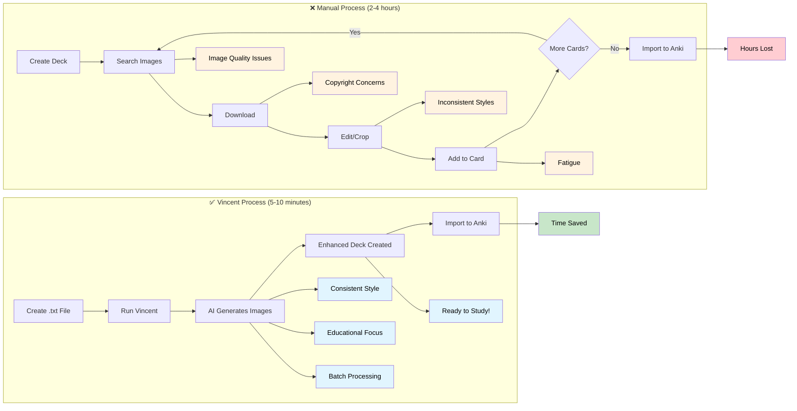

```
██╗   ██╗██╗███╗   ██╗ ██████╗███████╗███╗   ██╗████████╗
██║   ██║██║████╗  ██║██╔════╝██╔════╝████╗  ██║╚══██╔══╝
██║   ██║██║██╔██╗ ██║██║     █████╗  ██╔██╗ ██║   ██║   
╚██╗ ██╔╝██║██║╚██╗██║██║     ██╔══╝  ██║╚██╗██║   ██║   
 ╚████╔╝ ██║██║ ╚████║╚██████╗███████╗██║ ╚████║   ██║   
  ╚═══╝  ╚═╝╚═╝  ╚═══╝ ╚═════╝╚══════╝╚═╝  ╚═══╝   ╚═╝   
```

# Vincent - AI Images for Anki

Transform your Anki flashcards with AI-generated educational images using Google's free Gemini API.

## Quick Start

```bash
# Install globally
npm install -g vincent-anki

# Process your deck
vincent my-deck.txt
```

That's it! Vincent will:
1. Analyze your deck and show card count
2. Prompt for Gemini API key (free tier)
3. Generate educational images for each card
4. Create enhanced deck: `my-deck-illustrated.txt`
5. Ready to import into Anki!

## Problem Statement

Creating effective Anki flashcards with relevant images is a time-consuming process:

- **Manual Image Hunt**: Searching for the perfect educational image for each card
- **Inconsistent Quality**: Mix of image styles, resolutions, and relevance
- **Time Sink**: 2-5 minutes per card adds up to hours for a full deck
- **Cognitive Load**: Context switching between learning content and finding images
- **Burnout Risk**: Repetitive process leads to deck abandonment

## Solution

Vincent automates the entire image generation process, transforming hours of manual work into minutes of automated generation:



Vincent transforms the flashcard creation workflow:
- **⏱️ Time**: 2-4 hours → 5-10 minutes
- **🎨 Consistency**: Random images → Cohesive educational style
- **🧠 Focus**: Stay in learning mode instead of image hunting
- **📈 Scale**: Process entire flashcard decks at once

## Features

- **100% Free**: Uses Gemini's free tier (no cost)
- **Effortless**: Single command transforms entire decks
- **Educational**: AI generates study-optimized images
- **Multiple Styles**: Educational, Medical, or Colorful themes

## Installation

```bash
npm install -g vincent-anki
```

## Usage

```bash
# Basic usage
vincent deck.txt

# Specify output file
vincent deck.txt -o enhanced-deck.txt

# Choose style
vincent deck.txt --style medical

# Dry run (see what would be done)
vincent deck.txt --dry-run
```

## Development & Testing

For development or testing without a Gemini API key, use mock mode:

```bash
# Mock mode - generates placeholder images for testing
npx tsx src/cli.ts --mock test-deck.txt

# This creates test files without making API calls
# Perfect for development and CI/CD testing
```

## API Key Setup

On first run, Vincent will guide you through getting a free Gemini API key:

1. Visit: https://makersuite.google.com/app/apikey
2. Create a free account
3. Generate an API key
4. Enter it when prompted

Your key is saved locally for future use.

## Output

Vincent creates:
- Enhanced `.txt` file ready for Anki import in `vincent-output/` folder
- Generated PNG images alongside the text file in `vincent-output/` folder
- Images are automatically embedded in your flashcards

## Requirements

- Node.js 18+ 
- Valid `.txt` file formatted for Anki importing. Must use semicolons `;` to seperate. see below

```
question;answer
question;answer
question;answer
```

- Internet connection
- Free Gemini API key

## Iteration 1 - Perfect Conditions MVP

This version assumes perfect conditions:
- Stable internet connection
- Valid API key with available quota
- Terminal remains open during processing
- No error recovery or session management

Future iterations will add robustness, session recovery, and background processing.

## License

Apache 2